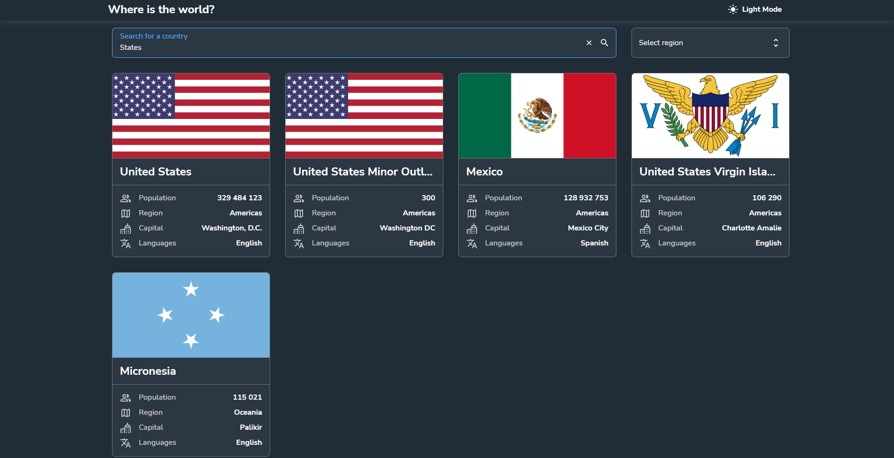

<h1 align="center">Where is the world</h1>

  Made with <code>HTML</code>, <code>CSS</code>, <code>TypeScript</code>, <code>ReactJS</code>, <code>styled-components</code>

  Bootstrapped with <code>Vite</code>

  

  

  

  

  

  
  

  

  

  
  

## ℹ️ About

This is a solution to the challenge "REST Countries" from Frontend Mentor ([link](https://www.frontendmentor.io/challenges/rest-countries-api-with-color-theme-switcher-5cacc469fec04111f7b848ca/hub)).

The challenge is to integrate with the [REST Countries API](https://restcountries.com) to pull country data and display it like in the designs.

I made my own Figma prototype and redesigned the whole application.

Figma prototype: https://www.figma.com/file/9TUVcloltVpCdi5LHVCiVT/Countries

## ⚙️ Tools

- **HTML5**
  - ReactJS
- **CSS**
  - styled-components
- **TypeScript**
  - ReactJS
  - React Query
  - React Router
  - Vitest
  - Cypress
- **NodeJS**
- **Vite**
- **Github Pages**

## 🔨 Build project

<table>
  <tr>
    <th>Command</th>
    <th>Description</th>
  </tr>
  <tr>
    <td><code>npm&nbsp;run&nbsp;dev</code></td>
    <td>Starts a local web server with HMR (Hot Module Replacement) for development</td>
  </tr>
  <tr>
    <td><code>npm&nbsp;run&nbsp;preview</code></td>
    <td>Start a local web server that serves the built solution from <code>./build</code> for previewing</td>
  </tr>
  <tr>
    <td><code>npm&nbsp;run&nbsp;predeploy</code></td>
    <td>Builds the project, and outputs to the folder <code>./build</code></td>
  </tr>
</table>

## 📁 File Structure

<table>
  <tr>
    <th>Path</th>
    <th>Description</th>
  </tr>
  <tr>
    <td colspan="2"></td>
  </tr>
  <tr>
    <td><code>build</code></td>
    <td>Folder with files generated by Vite</td>
  </tr>
  <tr>
    <td colspan="2"></td>
  </tr>
  <tr>
    <td><code>src</code></td>
    <td>Source files needed for application development</td>
  </tr>
  <tr>
    <td><code>src / assets</code></td>
    <td>Folder with static assets (images, favicon)</td>
  </tr>
  <tr>
    <td><code>src / components</code></td>
    <td>Folder with React components</td>
  </tr>
  <tr>
    <td><code>src / global</code></td>
    <td>Folder with global styles and parameters</td>
  </tr>
  <tr>
    <td><code>src / hooks</code></td>
    <td>Folder with custom hooks</td>
  </tr>
  <tr>
    <td><code>src / pages</code></td>
    <td>Folder with pages</td>
  </tr>
  <tr>
    <td><code>src / utils</code></td>
    <td>Folder with utility functions</td>
  </tr>
  <tr>
    <td><code>src / App.tsx</code></td>
    <td>Main code for the application</td>
  </tr>
  <tr>
    <td><code>src / App.styled.tsx</code></td>
    <td>Styles for App.tsx (styled-components)</td>
  </tr>
  <tr>
    <td><code>src / index.tsx</code></td>
    <td>Entry point for the module bundler</td>
  </tr>
  <tr>
    <td><code>src / styles.css</code></td>
    <td>Styles for a spinner that is showed until all JS files are loaded</td>
  </tr>
  <tr>
    <td><code>src / index.html</code></td>
    <td>Main html file</td>
  </tr>
  <tr>
    <td colspan="2"></td>
  </tr>
  <tr>
    <td><code>docs</code></td>
    <td>Folder with additional information, documentation</td>
  </tr>
  <tr>
    <td><code>docs / results</code></td>
    <td>Folder with screenshots of how the application works after being fully developed</td>
  </tr>
  <tr>
    <td colspan="2"></td>
  </tr>
  <tr>
    <td><code>LICENSE</code></td>
    <td>MIT License</td>
  </tr>
  <tr>
    <td><code>tsconfig.json</code></td>
    <td>Configuration for TS compiler</td>
  </tr>
  <tr>
    <td><code>tsconfig.node.json</code></td>
    <td>Some other configuration for TS compiler? Vite added it, so ... it is what it is</td>
  </tr>
  <tr>
    <td><code>package-lock.json</code></td>
    <td>JSON file that keeps track of the exact version of every package that is installed so that a product is 100% reproducible in the same way even if packages are updated by their maintainers</td>
  </tr>
  <tr>
    <td><code>package.json</code></td>
    <td>JSON file that holds various metadata relevant to the project. This file is used to give information to npm that allows it to identify the project as well as handle the project's dependencies</td>
  </tr>
  <tr>
    <td><code>vite.config.js</code></td>
    <td>Configuration for Vite module bundler</td>
  </tr>
  
</table>

## 📦 NPM Packages worth mentioning

- `styled-components` - For CSS-in-JS
- `react-loading-skeleton` - Used it to show skeletons while fetching new data
- `react-outside-click-handler` - Used it to close options list in select component when clicking outside
- `gh-pages` - Used to deploy project to Github
- `react-router-dom` - Used it to route user between pages
- `react-transition-group` - Used it to animate showing and hiding of options list
- `antd` - Used 1 component from it : Image, that helps to open image in a full-screen mode
- `@tanstack/react-query`, `@tanstack/react-query-devtools` - For API requests

## 💡 Details

Another project that seemed to be very simple, but took 2-3 weeks to complete

Features

- Light / Dark mode
- Skeletons during load
- Page for the list of countries, page for a country
- Custom select, input fields
- Used a component from Ant Design (but it looks like it made the bundle realy, really big)

## 🔗 Useful resources

- [Web Dev Simplified Hooks Course](https://courses.webdevsimplified.com/view/courses/react-hooks-simplified/1411296-introduction/4376388-00-introduction) - Great course with a lot of custom hooks
- [How to Make a Custom Select Component](https://codepen.io/tcomdev/pen/WNXeqoG)
- [StackOverflow : Guide on a spinner](https://stackoverflow.com/questions/40987309/react-display-loading-screen-while-dom-is-rendering)
- [How to Make a Custom Spinner](https://www.w3schools.com/howto/tryit.asp?filename=tryhow_css_loader)
- [How to deploy a react app on GH Pages](https://www.freecodecamp.org/news/deploy-a-react-app-to-github-pages/) - to put shortly, just use HashRouter in the application
- [How to Make a Custom Scrollbar](https://www.w3schools.com/howto/howto_css_custom_scrollbar.asp)

## 👤 Author

- Frontend Mentor - [@GrbnvAlex](https://www.frontendmentor.io/profile/GrbnvAlex)
- Telegram - [@Arlagonix](https://t.me/Arlagonix)
- Github - [@arlagonix](https://github.com/arlagonix)
